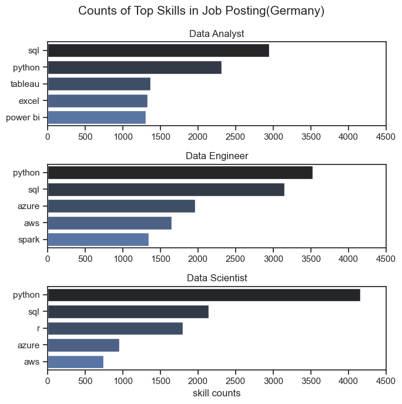

# Analysis and Insights of the Top Skills in Job Postings (Germany)

## Analysis

### What are the most in-demand skills across Data Analyst, Data Engineer, and Data Scientist roles in Germany?

This analysis focuses on the most in-demand skills for Data Analyst, Data Engineer, and Data Scientist roles in Germany, based on job postings.

Data Analysts: Key skills include SQL, Excel, and data visualization tools like Tableau. These are essential for analyzing and presenting data.

Data Engineers: Important skills are Python, SQL, Big Data technologies, and Cloud platforms (e.g., AWS). These are needed for building and maintaining data infrastructure.

Data Scientists: In-demand skills include Python, Machine Learning, and Statistical Analysis, with strong emphasis on data modeling and algorithm development.

Key Trends:
Programming: Python and SQL are crucial across all roles, with Python being particularly important for Data Engineers and Data Scientists.

Cloud & Big Data: Strong demand for cloud platforms and Big Data tools among Data Engineers.

Visualization: Data Analysts and Data Scientists require proficiency in visualization tools like Tableau.

View my notebook with detailed steps here:
[2.skill_count.ipynb](5.project\2.skill_count.ipynb)

### Visualize Data

```python
sns.set_theme(style='ticks')
fig, ax = plt.subplots(3,1, figsize=(7, 7))

for i,job_titles in enumerate(job_titles):
    df_Ger_plot = df_skill_count_Ger[df_skill_count_Ger['job_title_short'] == job_titles].head(5)
    #df_Ger_plot.plot(kind='barh', x='job_skills', y='skill counts', ax=ax[i], title=job_titles)
    sns.barplot(data=df_Ger_plot, x='skill counts', y='job_skills', ax=ax[i], hue='job_skills', palette='dark:b')
    #ax[i].invert_yaxis()
    ax[i].set_xlim(0,4500)
    ax[i].set_ylabel("")
    ax[0].set_xlabel("")
    ax[1].set_xlabel("")
    ax[i].set_title(job_titles, fontsize=12)

plt.suptitle('Counts of Top Skills in Job Posting(Germany)', fontsize=15)
plt.tight_layout()
plt.show()
```

## Result

### Visualization for Top skills in Job Posting(Germany)



### Insight on Top Skills for Data Roles in Germany

The code visualizes the distribution of key skills required for three specific data-related job titles: Data Analyst, Data Engineer, and Data Scientist. The following insights can be drawn from this visualization:

#### 1.Common Skills Across Roles:

SQL and Python are fundamental skills across all three job titles. SQL is crucial for querying and managing databases, while Python is essential for data manipulation and analysis.

Data Visualization skills (e.g., Tableau, Power BI, or Matplotlib) are especially critical for Data Analysts and Data Scientists, highlighting the importance of presenting insights clearly.

#### 2.Role-Specific Skills:

Data Analysts tend to focus more on data presentation tools and data cleaning techniques (e.g., Excel).

Data Engineers show a stronger emphasis on Big Data technologies like Hadoop or Spark and Cloud platforms such as AWS, indicating the importance of building and maintaining data infrastructure.

Data Scientists require Machine Learning and Statistical Analysis skills, reflecting their role in building predictive models and performing advanced analytics.

#### 3.Top Skills in Demand:

The top skills for each role (from the top 5 most frequent) reflect the evolving demand for specific competencies in the tech industry.

The most in-demand skills might also indicate trends in the job market, such as the rising need for cloud computing, big data management, and machine learning across various sectors.

##### By examining the top skills required for each role, job seekers can align their skillset to meet industry demands and improve their chances in the competitive job market. Additionally, employers can use this analysis to refine their job postings and recruit professionals with the most relevant expertise.
